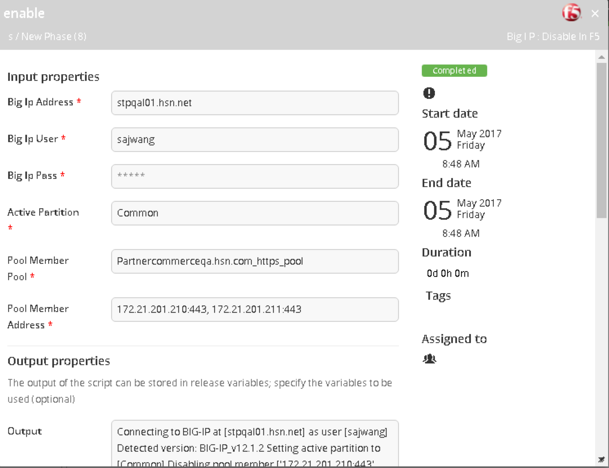
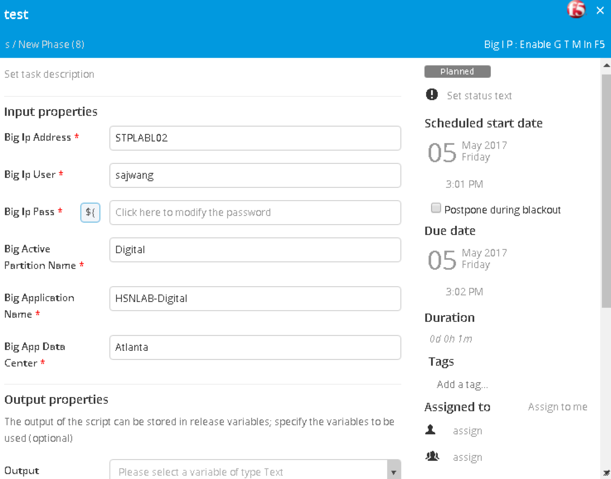
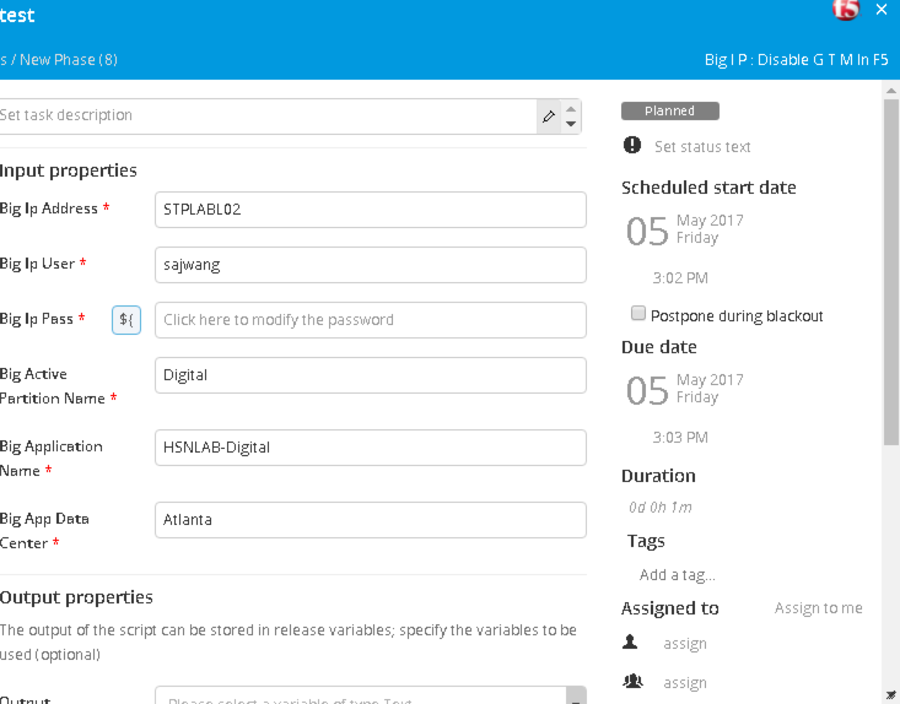

# xlr-F5-plugin
Plugin for GTM/LTM

## Preface
This document describes the functionality provide by the `xlr-F5-plugin`.

## Overview
#### GTM:
Global traffic manager (GTM) integration with Xl release gives an option to enable and disable datacenters of choice. GTM gives you full control on the release flow.

#### LTM:
Local traffic manager (LTM) integration with Xl release gives an option to enable and disable pool-member in a specific pool whithout shutting down pool itself.
It also gives you an option to enable/disable  multiple pool members.

## Installation
Copy the plugin JAR file into the `SERVER_HOME/plugins` directory of XL Release.
Install Python 2.7.x and the additional [pycontrol](https://pypi.python.org/pypi/pycontrol) and [suds](https://pypi.python.org/pypi/suds) libraries on the xl release server.
This plugin is mean to run the python script on the xl release windows server.

### Configuring Template

#### Enable LTM

#### Disable LTM

#### Enable GTM

#### Disable GTM

---
## References:
* https://devcentral.f5.com/wiki/iControl.LocalLB.ashx
* https://devcentral.f5.com/wiki/iControl.GlobalLB.ashx